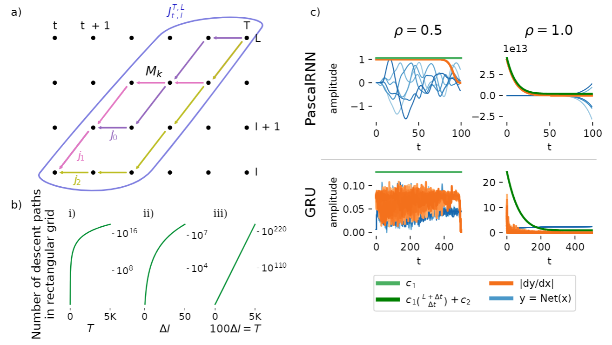

# Stabilizing RNN Gradients through Pre-training

This is the official repository of the article [Stabilizing RNN Gradients through Pre-training](https://arxiv.org/abs/2308.12075), submitted to IEEE.




The scripts and folders mentioned in the following can be found inside ```stable_drnn/src/stabledrnn```.
Run the codes after doing ```pip install -r requirements.txt```. You can install
it as a package with ```pip install git+https://github.com/LuCeHe/stable_drnn```.
The FFN experiments are done with the ```training_ffns.py``` script while the RNN experiments
are done with the ```training_rnns.py``` script. Run ```plot_gradient_grid.py``` to generate
Figure 1 a), ```plot_binomial.py``` to generate Figure 1 b) and ```plot_pascalrnn.py``` 
to generate Figure 1 c).

For Figure 2, run as one line


```
python training_ffns.py
     --depth=30 --width=128 --epochs=50 --steps_per_epoch=-1 --pretrain_epochs=100
     --activation=##act##
     --dataset=##data##
     --lr=##lr##
     --seed=##seed##
     --comments=##comments##
```

 
with ```##act##``` in ```[sin, relu, cos]```,  ```##data##``` in ```[mnist, cifar10, cifar100]```, 
 ```##lr##``` in ```[1e-2, 3.16e-3, 1e-3, 3.16e-4, 1e-4, 3.16e-5, 1e-5]```, ```##seed##``` in ```list(range(4))```,
and ```##comments##``` in ```[findLSC_radius_adabelief_pretrained_onlypretrain]```, and when pretraining has finished successfully,
run the same hyperparams but this time with 
```##comments##``` in ```[findLSC_radius_adabelief_onlyloadpretrained, _adabelief_onlyloadpretrained, heinit_adabelief_onlyloadpretrained]```.

For Figure 3, run 

```
python training_rnns.py with
     stack=##depth## n_neurons=None batch_size=None steps_per_epoch=None lr=None
     task=##data## net=##net##
     seed=##seed##
     comments=##comments##
```

with ```##depth##``` in ```[2, 5]```, ```##task##``` in ```[wordptb, heidelberg, sl_mnist]```, 
```##net##``` in ```[LSTM, GRU, rsimplernn, ssimplernn, maLSNN, maLSNNb]```, 
seed as before and for pretraining run with 
```##comments##``` in ```[allns_embproj_nogradreset_dropout:.3_timerepeat:2_pretrained_findLSC_radius_targetnorm:.5_onlypretrain,
 allns_embproj_nogradreset_dropout:.3_timerepeat:2_pretrained_findLSC_radius_onlypretrain]```,
and once the pretrained weights are ready, run with 
```##comments##``` in ```[allns_embproj_nogradreset_dropout:.3_timerepeat:2_pretrained_findLSC_radius_targetnorm:.5_onlyloadpretrained,
 allns_embproj_nogradreset_dropout:.3_timerepeat:2_pretrained_findLSC_radius_onlyloadpretrained,
allns_embproj_nogradreset_dropout:.3_timerepeat:2_pretrained_onlyloadpretrained]```.

Figure 4

Table 1