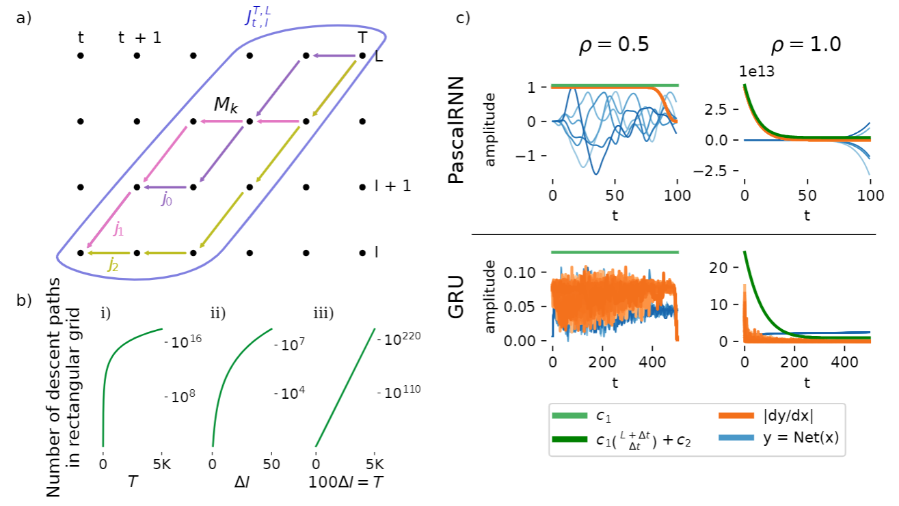

# Stabilizing RNN Gradients through Pre-training

This is the official repository of the [Stabilizing RNN Gradients through Pre-training](https://arxiv.org/abs/2308.12075) 
article, submitted to IEEE.




The FFN experiments are done with the ```training_ffns.py``` script while the RNN experiments
are done with the ```training_rnns.py``` script. Run ```plot_gradient_grid.py``` to generate
Figure 1 a), ```plot_binomial.py``` to generate Figure 1 b) and ```plot_pascalrnn.py``` 
to generate Figure 1 c).

For Figure 2, run as one line


```
python stable_drnn/training_ffns.py
     --depth=30 --width=128 --epochs=50 --steps_per_epoch=-1 --pretrain_epochs=100
     --activation=##act##'
     --dataset=##data##
     --lr=##lr##
     --seed=##seed##
     --comments=##comments##
```

 
with ```##act##``` in ```['sin', 'relu', 'cos']```,  ```##data##``` in ```['mnist', 'cifar10', 'cifar100']```, 
 ```##lr##``` in ```[1e-2, 3.16e-3, 1e-3, 3.16e-4, 1e-4, 3.16e-5, 1e-5]```, ```##seed##``` in ```list(range(4))```,
and ```##comments##``` in ```['findLSC_radius_adabelief_pretrained_onlypretrain']```, and when pretraining has finished successfully,
run the same hyperparams but this time with 
```##comments##``` in ```['findLSC_radius_adabelief_onlyloadpretrained', '_adabelief_onlyloadpretrained', 'heinit_adabelief_onlyloadpretrained']```.

For Figure 3, run 

```
python stable_drnn/training_rnns.py with
     stack=##depth## n_neurons=None batch_size=None steps_per_epoch=None lr=None
     task=##data## net=##net##
     seed=##seed##
     comments=##comments##
```

with ```##depth##``` in ```[2, 5]```, ```##task##``` in ```[wordptb, heidelberg, sl_mnist]```, 
```##net##``` in ```[LSTM, GRU, rsimplernn, ssimplernn, maLSNN, maLSNNb]```, seed as before

Figure 4

Table 1